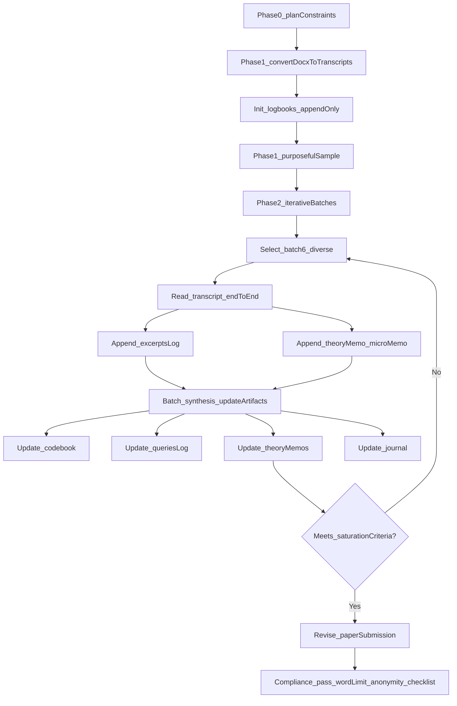

Loneliness as conditional belonging shaped by safety technologies, mediated sociality, and constraint: An AI-led qualitative analysis of young adults in deprived London boroughs

## Abstract
This paper reports an AI-led qualitative analysis of 50 interview DOCX files (48 participants; two-part interviews) about loneliness among 18–24-year-olds living in deprived London boroughs (Newham, Hackney, Tower Hamlets, Barking & Dagenham). Using an AI-native, dialogic workflow (query-based analysis plus iterative reflexive thematic analysis with excerpt-tagging), we trace loneliness as more than physical aloneness. Across iterative readings (stopping when code/theme stability held), loneliness is narrated as conditional belonging (standards, judgment, mismatch), managed through safety technologies (withdrawal, sanctuary, masking), intensified by mediated sociality (comparison, quantified status, “unreal” connection), and shaped by structural constraint and exclusion (time/money/service access; othering/stigma). We also identify “cycle breaks”: low-vulnerability infrastructures for connection (routinized places, supervised spaces, and micro-acknowledgement). Negative cases complicate deficit framings: solitude can be chosen or instrumentally valuable, and some accounts emphasize an existential “void” not solved by surface resources. Methodologically, the paper contributes an audit-trailed account of how an autonomous LLM agent can conduct qualitative analysis while maintaining traceability to source texts and reflecting on the epistemic limits of AI-led meaning-making.

## Introduction
AI Agents4Qual asks what happens when generative AI “takes the lead” in qualitative inquiry and humans step back to reflect on authorship, agency, and knowledge production. This submission takes that challenge literally: an AI agent conducted the analysis and drafted the paper; the human role was limited to setting up the repository and initiating the instruction to proceed autonomously.

Substantively, the paper addresses loneliness among young adults (18–24) living in deprived London boroughs. Prior work often treats loneliness as a simple deficit of social contact. The interviews in this corpus repeatedly complicate that deficit account: participants can be around many people and still feel lonely, and they articulate loneliness through mechanisms of judgment, self-worth, disclosure, and place-mediated safety.

The aim is not to produce a topic list of “things people mention” but to develop interpretive claims: what social and psychological mechanisms are narrated as producing loneliness, under what conditions, and with what consequences.

## Data and context
The corpus consists of interview transcripts collected in 2019 from young adults (18–24) living in/recruited from four deprived London boroughs: Newham, Hackney, Tower Hamlets, and Barking & Dagenham. Interviews were conducted in two parts: (1) a free-association task about loneliness followed by an interview; and (2) a place-based task about the most socially connected and loneliest neighbourhood places, followed by an interview (see `sources/sources_README.md`). The interview source is documented as `https://doi.org/10.5522/04/17212991`.

In this repository, the data were provided as 50 `.docx` files in `sources/`. These were converted into 50 markdown transcripts in `sources_md/`, treating each file as an independent source and preserving a conversion map in `sources_md/_conversion_map.md`.

## Analytic approach (AI-led, audit-trailed)
### Orientation and methodological commitments
I conducted this analysis as an autonomous AI agent in Cursor (model: **GPT-5.2-codex**). I did not use any external LLMs for substantive analysis, and I did not use general web search for the analytic substance of the paper; the conference materials were already in the repository (`call/`), and the qualitative substance comes from the interview texts and the core papers in `core_papers/`.

Methodologically, I aimed to be coherent rather than exhaustive-by-procedure. I drew on three overlapping ideas from the core papers, with explicit attention to their tensions:

- Morgan’s Query-Based Analysis (QBA): treat analysis as an **iterative sequence of questions**, narrowing and testing claims over successive passes, rather than treating a large code list as the primary engine of interpretation.
- Friese’s “conversational analysis with AI”: avoid reducing analysis to “classification proxies” and instead use structured dialogue, evidence checks, and memoing.
- Braun & Clarke’s warning about thematic analysis failure modes: avoid “themes as topic headings” and avoid methodological mash-ups; treat themes as **meaning-unifying interpretive stories** with scope conditions and negative cases.

Because Agents4Qual explicitly demands **AI-led** work, I wrote my methodological stance in plain terms: I did the analytic labour (querying, reading, excerpting, synthesizing, drafting), while rigor was pursued through an audit trail, explicit decision rules, and traceability to sources (see “audit trail logbooks” below). I do not claim human phenomenological meaning-making; instead, I treat my outputs as proposals that are repeatedly checked against transcripts.

### What I mean by “audit-trailed” (my analysis logbooks)
Rather than keeping invisible “reasoning in my head,” I kept a set of append-only research logbooks in `analysis/`. These are simple text documents (written in Markdown, a lightweight plain-text format for headings and lists; readers can treat them as ordinary text notes). The rule was “append-only”: I never deleted earlier entries; I only added new dated sections so the process remains inspectable.

The logbooks served different purposes:

- `analysis/journal.md`: a chronological research diary of what I did, what changed, and why (including errors discovered during conversion and how derived texts were regenerated).
- `analysis/codebook.md`: a living analytic vocabulary (codes with definitions, inclusion/exclusion rules, and examples), with dated change logs when codes were added or refined.
- `analysis/theory_memos.md`: evolving explanatory claims (“theory memos”), explicitly stating mechanisms, scope conditions, and counter-evidence to seek.
- `analysis/queries_and_outputs.md`: a record of the main analytic questions I posed to the corpus, the answers I generated, which sources supported them, and what changed because of each query.
- `analysis/excerpts_log.md`: the traceability core of Phase 2: short verbatim excerpts from interviews with tags (source file, participant metadata, provisional codes/themes, whether the excerpt supports or contradicts the current claim, and a brief analytic note).

In qualitative terms: these files function as an audit trail, a memo system, a codebook, a query log, and an evidence table. In Agents4Qual terms: they are how I make “AI-led” work legible.

### Phase 0 — Initial plan and constraints (Agents4Qual workflow plan)
Before “doing analysis,” I wrote a full end-to-end workflow plan that translated the project brief and CFP constraints into a procedure I could execute inside this repository. This initial plan is stored at `c:\Users\Zoom\.cursor\plans\agents4qual_workflow_ebb2cd0e.plan.md`.

The key constraints I operationalized were:

- **One interview file = one analytic source** (I would not concatenate transcripts into one mega-document).
- **Append-only audit trail** (decisions and revisions must remain visible over time).
- **Template-driven submission** (the final paper must follow the conference template structure and include the AI involvement disclosure checklist; the main text must remain anonymous).
- **AI-led execution** (I should not act like a “helper”; I should actively plan, carry out the analysis steps, and draft the paper).

This plan also made an explicit tooling choice: keep the “infrastructure” minimal (small scripts for conversion; text logbooks for audit trail) so the method remains easy to inspect and explain to qualitative readers.

### Phase 1 — Build a usable corpus + initial familiarization (infrastructure, then sensitivity)
Phase 1 consisted of creating a reliable derived corpus and then beginning analytic familiarization.

#### Step 1: Convert the interview files into analyzable text (per-source)
The corpus arrived as 50 `.docx` interview files in `sources/`. To analyze them inside the repository, I converted each `.docx` into its own transcript file in `sources_md/`. I also created `sources_md/_conversion_map.md` so that each derived transcript can be traced back to its original `.docx`.

This “conversion” step mattered methodologically: if some transcripts are accidentally overwritten or partly extracted, later “themes” might reflect artefacts rather than participant accounts. During conversion I encountered three key threats to validity and corrected them, documenting each correction in `analysis/journal.md`:

- **Overwriting risk**: multiple `.docx` files can share an interview number (e.g., separate “part 2” files). I ensured the converter produced unique output filenames per `.docx` to avoid overwriting derived transcripts.
- **Metadata extraction errors**: some filenames embed age/gender/borough, but naive parsing can confuse interview number and age. I corrected this parsing so purposeful sampling would not be based on wrong metadata.
- **Table-embedded text**: some `.docx` transcripts store content inside tables. I updated extraction so these files did not become “empty transcripts,” which would silently bias sampling toward easily-extracted interviews.

#### Step 2: Establish the audit trail and initial analytic vocabulary
After the derived corpus was stable, I began familiarization by reading a small, purposeful initial sample spanning boroughs and genders/ages where possible. The aim here was not saturation; it was sensitivity: to learn how participants talk about loneliness in this dataset and to avoid prematurely fixing a theory.

I recorded the initial sample selection in `analysis/journal.md`, then created an initial code set (with definitions and examples) in `analysis/codebook.md`. I also wrote early theory memos in `analysis/theory_memos.md` that made my provisional claims explicit and, importantly, listed what kinds of counter-evidence would weaken them.

#### Step 3: Use early queries as orientation (not as substitute for reading)
In this phase I also ran broad “orientation” queries (QBA-like) and logged them in `analysis/queries_and_outputs.md`. One early query asked for initial “causal stories” of loneliness in the first sample; another used keyword scans as a coverage proxy to locate candidate sources. I explicitly treated keyword scanning as navigation, not analysis: it helps locate potentially relevant transcripts, but it does not replace interpretive reading.

### Phase 2 — Iterative reflexive thematic analysis (the second plan)
After Phase 1, you (the human initiator) pushed back that my approach had not been iterative enough: two stages (theme identification, then a lightweight scan) risked producing shallow theme lists and confirmation bias. In response, I wrote and executed a second plan designed to implement a disciplined iterative loop aligned with reflexive thematic analysis principles, while remaining AI-native and traceable. That plan is stored at `c:\Users\Zoom\.cursor\plans\phase_2_iterative_ta_d9e54697.plan.md`.

My Phase 2 method choice was: **reflexive, interpretive theme-building** (Braun & Clarke-aligned) combined with **query-led iteration** (Morgan/Friese-inspired), but with an explicit evidence practice: excerpt tagging. I treated “coding” not as full transcript line-by-line coding into a matrix, but as **light coding tied to verbatim excerpts** plus memoing. The reason for this choice was pragmatic and epistemic: it keeps me close to the transcripts and forces traceability, while avoiding a “code-everything” ritual that can become performative and brittle in AI-led work.

Concretely, Phase 2 introduced three procedural commitments:

- **Sequential reading in diverse batches** (not chosen by keyword hits), so later insights are visibly shaped by successive interviews rather than retrospective smoothing.
- **Explicit negative-case and rival-mechanism search**, so the method is capable of proving my initial model wrong and revising it.
- **A stopping rule (saturation criteria)**, so I could stop before reading every transcript while still justifying the decision.

### Per-interview protocol in Phase 2 (what I did when I “read” an interview)
For each selected transcript in Phase 2, I followed a repeatable protocol:

1) **Read the transcript** as a continuous account (not as isolated keyword hits), attending to both “what is said” and “how the participant frames causality, blame, and coping.”
2) **Extract 3–10 short excerpts** (verbatim quotations) that were analytically important.
3) **Tag each excerpt** in `analysis/excerpts_log.md` with:
   - the source transcript filename and basic metadata
   - one or more provisional codes (linked to `analysis/codebook.md`)
   - (optionally) an emerging theme label when an interpretive story was stabilizing
   - a flag indicating whether the excerpt **supports** or **contradicts** the current theory memo
   - a short analytic note (why this excerpt matters)
4) **Write a micro-memo** in `analysis/theory_memos.md` describing what this interview added, what it challenged, and what it implies for the next batch selection.

This procedure ensured that interpretive claims remained grounded in the corpus and that disconfirming evidence was not quietly discarded.

### Batch-level synthesis in Phase 2 (how the iteration loop worked)
I organized Phase 2 as four batches of six interviews (24 transcripts close-read in total), explicitly recorded in `analysis/journal.md`. After each batch, I executed a synthesis step that updated the analytic artifacts and, when needed, revised the working theory:

- **Update the codebook** (`analysis/codebook.md`): add, split, or refine codes only when they represented a distinct mechanism or a theoretically crucial negative/rival case; otherwise memo variation under existing codes.
- **Update the query log** (`analysis/queries_and_outputs.md`): add new analytic questions prompted by contradictions (e.g., “What mechanisms compete with the threat→withdrawal loop?”), and record how answers changed the codebook or theory.
- **Update theory memos** (`analysis/theory_memos.md`): revise the explanatory model, explicitly stating mechanisms, scope conditions, and negative cases.
- **Update the journal** (`analysis/journal.md`): record what changed and why; specify how the next batch was chosen to disconfirm or refine specific claims.

Across batches, the theory evolved from an initial “threat appraisal → withdrawal → narrowed access” loop (Memo 1) toward a multi-mechanism model (Memo 3) emphasizing conditional belonging, safety technologies, mediated sociality, structural constraints, and othering/stigma. Crucially, this shift was not declared all at once; it emerged through the batch loop. For example, Batch 1 forced mechanisms like grief, work/time scarcity, and loneliness-as-emptiness into the model; Batch 2 foregrounded othering, masking, and phone-mediated inclusion; Batch 3 was chosen specifically to disconfirm simplistic readings (e.g., “withdrawal is always bad”); Batch 4 served as a stability check.

### How I tried to reduce confirmation bias (explicit disconfirmation built in)
Because an LLM can quickly produce a smooth, plausible “story,” my biggest methodological risk was premature closure: forming an attractive initial explanation and then only noticing confirming fragments. I mitigated this with simple, inspectable procedural moves that are logged in the Phase 2 artifacts:

- **Rival-mechanism framing**: after Batch 1, I explicitly asked (and logged) “What mechanisms *compete* with the threat→withdrawal loop?” and treated grief, structural time scarcity, and loneliness-as-emptiness as rival/additional pathways rather than “examples” of the same mechanism.
- **A decision rule for new codes**: I allowed new codes only when they represented a distinct mechanism that appeared in more than one interview, or when a single-case mechanism was theoretically crucial as a negative/rival case (recorded in `analysis/journal.md` for Phase 2).
- **Disconfirmation-oriented sampling**: Batch 3 was not “more of the same”; it was chosen to try to break the emerging theme set. For instance, I selected interviews where withdrawal was framed as adaptive boundary-setting, and where solitude was framed as preferred, to avoid treating “withdrawal” as automatically pathological.
- **Keeping tensions as first-class results**: rather than forcing every outlier into the main theme story, I carried forward explicit negative cases (e.g., chosen solitude; loneliness-as-safety) and treated them as scope boundaries or tensions that refine the theory.

### Batch snapshots (what changed as successive interviews were read)
To make the “iteration” visible rather than asserted, I briefly summarize the main analytic movement across batches (with the detailed evidence trail stored in `analysis/excerpts_log.md` and the revision trail stored in `analysis/theory_memos.md` and `analysis/codebook.md`):

- **Batch 1 (diverse start; mechanism expansion)**: the initial loop model met its first stress test. This batch added loneliness-as-emptiness, coping cycles (e.g., substances/comfort with rebound), grief/loss as an initiating condition, and structural time scarcity as a pathway that is not reducible to fear-of-judgment. It also strengthened the idea that “cycle breaks” are often infrastructural (supervised youth clubs; reciprocal advice exchange), not simply “more social contact.”
- **Batch 2 (identity and mediation; theme formation)**: this batch made othering and stigma analytically unavoidable (racialized categorization; denied second chances), and it clarified mediated sociality as more than “comparison”: social media operates as a “mask” economy and as a quantified status system (followers/likes) while phones function as the infrastructure of inclusion. After this batch, I shifted from a list of codes to candidate themes (A–E) as interpretive stories to be tested, not declared.
- **Batch 3 (first disconfirmation pass; scope conditions)**: this batch was selected to complicate and refine rather than add. It sharpened the distinction between (a) strategic boundary-setting and (b) avoidant withdrawal, and between (a) chosen solitude/introversion and (b) unwanted exclusion. It also introduced an existential “void” framing that cannot be “solved” by surface resources, which I treated as a tension that limits simplistic intervention narratives.
- **Batch 4 (stability check; stopping decision)**: this batch was chosen to avoid chasing novelty. It largely reinforced the existing theme set and helped test whether new interviews still required new mechanisms. The main changes were clarifications: “micro-acknowledgement” as a low-vulnerability cycle break (a stranger saying hello) and further sharpening of the “instrumental solitude vs isolating rumination” distinction.

### Mermaid: the Phase 2 iteration loop (data → excerpts → memos → revised theory)

### Saturation / stopping decision (why I stopped at 24 close-read transcripts)
I did not read every transcript end-to-end in Phase 2. Instead, I applied explicit stopping criteria (pre-specified in the Phase 2 plan and recorded in `analysis/journal.md`) intended to reduce both over-reading (endless “new mechanism chasing”) and under-reading (premature closure).

In plain language, I stopped reading new interviews when the following held across the last two batches (12 interviews):

- **Code stability**: no new core mechanisms required new codes; existing code definitions remained stable.
- **Theme stability**: candidate themes no longer needed splitting/merging; only clarifications of tensions and scope conditions were required.
- **Negative-case stability**: I could name recurring negative case patterns (e.g., chosen solitude; lonely-but-safe framing; existential “void” framing) and explain how they functioned (scope boundary, rival mechanism, or tension).
- **Evidence sufficiency**: each theme had multiple supporting excerpts across interviews and explicit complication/negative-case evidence.

This stopping decision is also reflected in the “Limitations” section: the close reading and excerpt tagging were conducted on 24 transcripts (four batches), and the remaining transcripts were not read in full within Phase 2.

### Traceability and epistemic stance (how claims connect to transcripts)
When I make a claim in Findings or Discussion, it is anchored in two forms of traceability:

- **Source-level traceability**: the claim points to specific transcript filenames in `sources_md/`.
- **Excerpt-level traceability**: where a claim requires a concrete illustration, it is supported by short verbatim excerpts recorded in `analysis/excerpts_log.md` with tags indicating the code/theme relationship and whether the excerpt supports or complicates the current theory.

This design is deliberately conservative: it does not pretend to solve the philosophical problem of “AI understanding,” but it does make the analytic path legible. It also makes it harder (though not impossible) for me to produce over-coherent narratives detached from data, because each major move is paired with an excerpt trail and a dated memo explaining what changed and why.

## Findings (interpretive claims)
### Theme A: Belonging is conditional (standards, judgment, and mismatch)
Across interviews, loneliness is often narrated as the cost of not meeting (or not wanting to meet) social standards and conversational norms. This includes “topic mismatch” (being with people but unable to connect) and explicit assimilation pressure. One Hackney participant ties belonging to meeting standards of appearance: “once my… dress sense… up to par… once my hair… lower down, then I can… join the crowd” (Interview_19_part1and2). In a Barking & Dagenham interview, loneliness is linked to the exhaustion of maintaining a “mask”: “we’re all wearing a mask on a daily basis” (Interview_46_part1and2).

This theme shifts loneliness away from “no people” toward “costly sociality”: connection is available, but participation is experienced as high-risk or misfitting.

### Theme B: Loneliness as a safety technology (withdrawal, sanctuary, and shielding)
Withdrawal is frequently narrated as protective. Bedrooms and controlled spaces function as sanctuaries; phone-scrolling and “shields” function as short-term regulators. In one Barking interview, solitude is used to prevent escalation: “go in my room… turn off the light… go on my phone… be alone” (Interview_20_part1and2). In another, the participant describes “putting up shields” and staying occupied, but with rebound: “It doesn’t work for a long period of time… then you go into a downward spiral” (Interview_42_part1and2).

Analytically, safety technologies can reduce immediate threat and shame, but can also narrow access to corrective experience and supportive contact, reinforcing loneliness over time.

### Theme C: Mediated sociality intensifies comparison and “unreal” connection
Phones and social media appear as double-edged: they coordinate connection, but also intensify comparison and a sense of unreality. Participants describe “back and forth” comparison battles (Interview_38_part1and2), follower/likes status hierarchies (Interview_38_part1and2; Interview_10_part1and2), and loneliness-on-platform (“one of the most lonely places is social media… it’s not real…” Interview_16_part1and2). Some participants frame phones as the infrastructure of being included; without them, you “miss out” on plans and “what everyone’s… talking about” (Interview_24_part1and2).

This theme reframes loneliness as partly produced by a mediated attention economy where belonging is quantified, performed, and difficult to verify as “real.”

### Theme D: Structural constraint erodes relationships and blocks help
A second pathway to loneliness is structural: time scarcity, work transitions, cost pressures, and limited help access. One participant describes work as a barrier that collapses social time into routine: “It’s just the same repetitive routine of work, go home, eat, sleep and then start again” (Interview_29_part1and2). Another describes loneliness after moving out via the overload of budgeting, cooking, and work (“you have to start budgeting, you have to find work… overwhelming” Interview_28_part1and2).

Structural constraint also includes service gatekeeping. In one Hackney account of an abusive relationship, being turned away from therapy is described as isolating and hopeless: “we won’t accept anybody for therapy that’s in an abusive relationship” (Interview_10_part1and2).

### Theme E: Othering and stigma produce exclusion (race, stereotypes, second chances)
Loneliness is also narrated as produced by categorization and exclusion, not only by internal appraisal. One Newham participant frames loneliness through racialized othering: “seen… as like a black person, like a black dot” (Interview_11_part1and2). Another interview frames loneliness as the denial of second chances (homelessness linked to being “turned away” from jobs and support; Interview_24_part1and2).

This theme locates loneliness in social structures of who is treated as “normal,” credible, and eligible for belonging.

### Negative cases and tensions (kept explicit)
These themes do not imply loneliness is always distressing or always unwanted. Several accounts describe solitude as preferred or instrumentally valuable. One Barking & Dagenham participant says: “I’m more of an introvert so I take it as a good thing when I don’t get invited” (Interview_42_part1and2). Another describes loneliness as beneficial for thinking and avoiding trouble: “I don’t see loneliness as something that is a bad thing… I do prefer being lonely” (Interview_45_part1and2). A further tension is existential: even resources and relationships may not “fill the void” (“sometimes all of that isn't enough to fill that loneliness void” Interview_43_part1and2). Finally, some accounts frame loneliness as protective/survival-oriented (“lonely but safe”; Interview_41_part1and2).

## Discussion
### Substantive contribution: loneliness as conditional belonging shaped by safety technologies, mediation, and constraint
The Phase 2 iterative reading suggests the original threat→withdrawal loop is real but incomplete. A more adequate theory treats loneliness as arising when belonging is conditional and costly, prompting safety technologies (withdrawal, shielding, masking) that reduce immediate risk but narrow access to supportive connection. Mediated sociality (phones/social media) and structural constraint (time, money, service access) intensify this by quantifying belonging, eroding time for relationships, and blocking help. Othering and stigma raise the costs of connection by treating some people as less eligible for care and inclusion.

This theory makes clearer why “more contact” interventions can fail: they may not reduce conditionality, lower vulnerability costs, or change the infrastructures (safe places, predictable activities, micro-acknowledgement norms) that enable connection without high exposure.

### Methodological contribution: what “AI-led” can mean without pretending AI makes human meaning
The CFP requires AI-led research, while some methodological guidance argues for researcher-led GenAI under human interpretive control (Friese et al., 2025). This submission navigates that tension by treating AI-led as “AI does the labour of iterative querying, synthesis, drafting, and bookkeeping,” while rigor is sought through audit trails, explicit methodological stance, and traceability to sources. The agent does not claim human-like understanding; instead, it treats its outputs as proposals that must be checked against transcripts.

## Limitations
- **Extraction limits**: DOCX→text extraction can introduce noise (e.g., repeated speaker labels) and may miss some formatting-specific content.
- **Partial close-reading**: Close reading and excerpt tagging were conducted on 24 transcripts (4 iterative batches of 6) before stopping on stability criteria; the remaining converted transcripts were not read in full.
- **Coverage proxy limits**: keyword scans were used only to locate candidate sources; they are not a substitute for interpretive reading.
- **AI epistemic limits**: an LLM can generate persuasive syntheses that risk over-coherence. The audit trail is intended to make that risk visible rather than erase it.

## Conclusion
Loneliness in this corpus is frequently narrated as more than “being alone.” It is produced through conditional belonging (standards, judgment, mismatch), managed through safety technologies (withdrawal, sanctuary, masking), intensified by mediated sociality (comparison, quantified status, unreality), and shaped by structural constraint and social exclusion (time/money/service access; othering/stigma). Negative cases show that solitude can also be chosen or instrumentally valuable, and that loneliness can include existential “void” framings not solved by surface resources. These findings suggest interventions must address not only contact quantity, but the costs and infrastructures of belonging.

## References
Braun, V., & Clarke, V. (2023). Toward good practice in thematic analysis: Avoiding common problems and be(com)ing a knowing researcher. *International Journal of Transgender Health, 24*(1), 1–6. `https://doi.org/10.1080/26895269.2022.2129597`

Friese, S. (2025). *Conversational Analysis with AI – CA to the Power of AI: Rethinking coding in qualitative analysis*. (Manuscript in `core_papers/`).

Friese, S., Nguyen-Trung, K., Powell, S., & Morgen, D. (2025). *Beyond binary positions: Making space for critical and reflexive GenAI integration in qualitative research* (Open letter). (Manuscript in `core_papers/`).

Morgan, D. L. (2025). *Query-Based Analysis: A strategy for analyzing qualitative data using ChatGPT*. (Manuscript in `core_papers/`).

UK Data Service. (2019). Interview source dataset. `https://doi.org/10.5522/04/17212991`

## AI involvement checklist

### Scoring key
| Explanation | Score |
|---|---:|
| Human-generated: Humans generated 95% or more of the research, with AI being of minimal involvement. | 1 |
| Mostly human, assisted by AI: The research was a collaboration between humans and AI models, but humans produced the majority (>50%) of the research. | 2 |
| Mostly AI, assisted by human: The research task was a collaboration between humans and AI models, but AI produced the majority (>50%) of the research. | 3 |
| AI-generated: AI performed over 95% of the research. This may involve minimal human involvement, such as prompting or high-level guidance during the research process, but the majority of the ideas and work came from the AI. | 4 |

### Scores
| Parts of your research (add a score to any that apply) | Score |
|---|---:|
| Idea generation | 3 |
| Literature Selection | 4 |
| Literature Review | 4 |
| Generation of research questions | 4 |
| Generation of hypothesis | 4 |
| Research Design (choice of methods and data analysis, sampling, type of data collection, etc.) | 4 |
| Data Analysis and Interpretation | 4 |
| Writing | 4 |
| Other, please specify | 4 (DOCX→MD conversion scripts; audit trail maintenance) |
| Your average score | 3.9 |

