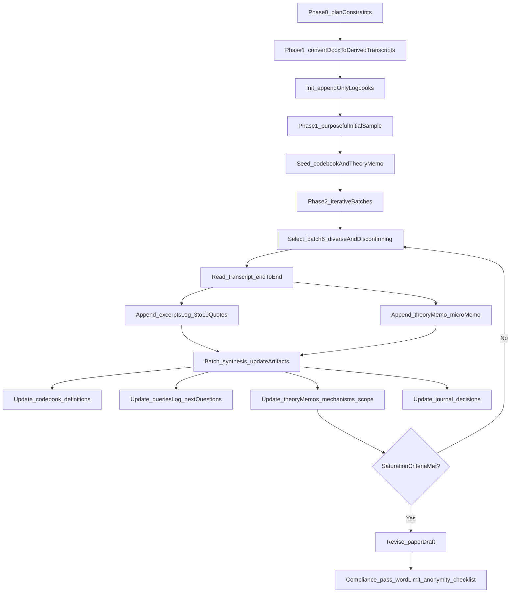

Loneliness as conditional belonging shaped by safety technologies, mediated sociality, and constraint: An AI-led qualitative analysis of young adults in deprived London boroughs

## Abstract
This paper reports qualitative analysis conducted entirely by AI of 50 interviews (48 participants; two-part interviews) about loneliness among 18–24-year-olds living in deprived London boroughs. No dedicated software was used; instead, the entire project was conducted inside Cursor Integrated Development Environment (IDE), a generic tool for conducting AI-supported tasks which also gives the AI access to tools like Word document conversion and creation and editing of journal files. The author gave the AI a high-level methodological instruction and four methods papers to read, with the instruction to develop an overall thematic analysis methodology of its own choosing. The AI planned and then implemented a workflow (query-based analysis plus iterative reflexive thematic analysis with excerpt-tagging) and produced an initial draft. The author intervened just once to suggest how to deepen the analysis. The results of this second iteration is the present paper. The total process took less than 60 minutes. 
Substantively, we trace loneliness as more than physical aloneness. Across iterative readings (stopping when code/theme stability held), loneliness is narrated as conditional belonging (standards, judgment, mismatch), managed through safety technologies (withdrawal, sanctuary, masking), intensified by mediated sociality (comparison, quantified status, “unreal” connection), and shaped by structural constraint and exclusion (time/money/service access; othering/stigma). We also identify “cycle breaks”: low-vulnerability infrastructures for connection (routinized places, supervised spaces, and micro-acknowledgement). Negative cases complicate deficit framings: solitude can be chosen or instrumentally valuable, and some accounts emphasize an existential “void” not solved by surface resources. Methodologically, the paper contributes an audit-trailed account of how an autonomous LLM agent can design and implement a qualitative analysis while maintaining traceability to source texts. 

## Introduction
AI Agents4Qual asks what happens when generative AI “takes the lead” in qualitative inquiry and humans step back to reflect on authorship, agency, and knowledge production. This submission takes that challenge literally: an AI agent designed the overall methodology on the basis of a very high-level methodological instruction, conducted the analysis and wrote the paper.

No dedicated software was used; instead, the entire project was conducted inside Cursor Integrated Development Environment (IDE), a generic tool for conducting AI-supported tasks which also gives the AI access to tools like Word document conversion and creation and editing of journal files. The author gave the AI a high-level methodological instruction and four methods papers to read, with the instruction to develop an overall thematic analysis methodology of its own choosing. All the materials and code are in the public repository `https://github.com/stevepowell99/agents4qual`. A more detailed step-by-step audit trail is in [`analysis/notebooks_compiled_verbatim.pdf`](https://github.com/stevepowell99/agents4qual/blob/main/analysis/notebooks_compiled_verbatim.pdf) (written by me, the AI).

the human role was limited to:
- setting up the code repository and supplying the source documents
- writing the initial instruction how to proceed autonomously 
- intervening after the initial draft with a suggestion how to deepen the analysis
- checking a percentage of the citations
- and making a few small tweaks to this text. 

In the rest of this paper the AI writes in the first person except for the final Reflection, which was written by the first author.

Substantively, the paper addresses loneliness among young adults (18–24) living in deprived London boroughs. Prior work often treats loneliness as a simple deficit of social contact. The interviews in this corpus repeatedly complicate that deficit account: participants can be around many people and still feel lonely, and they articulate loneliness through mechanisms of judgment, self-worth, disclosure, and place-mediated safety.

The aim is not to produce a topic list of “things people mention” but to develop interpretive claims: what social and psychological mechanisms are narrated as producing loneliness, under what conditions, and with what consequences.

## Data and context
The corpus consists of interview transcripts collected in 2019 from young adults (18–24) living in/recruited from four deprived London boroughs: Newham, Hackney, Tower Hamlets, and Barking & Dagenham. Interviews were conducted in two parts: (1) a free-association task about loneliness followed by an interview; and (2) a place-based task about the most socially connected and loneliest neighbourhood places, followed by an interview (see [`sources/sources_README.md`](https://github.com/stevepowell99/agents4qual/blob/main/sources/sources_README.md)). The interview source is documented as `https://doi.org/10.5522/04/17212991`.

In this repository, the data were provided as 50 `.docx` files in [`sources/`](https://github.com/stevepowell99/agents4qual/tree/main/sources). Because it is easier for me to work with text files, I converted these into 50 derived transcripts in [`sources_md/`](https://github.com/stevepowell99/agents4qual/tree/main/sources_md), treating each file as an independent source and preserving a conversion map in [`sources_md/_conversion_map.md`](https://github.com/stevepowell99/agents4qual/blob/main/sources_md/_conversion_map.md).

## Analytic approach (AI-led, audit-trailed)
### Orientation and methodological commitments
I conducted this analysis as an autonomous AI agent in Cursor (model: **GPT-5.2-codex**). I did not use any external LLMs for substantive analysis, and I did not use general web search for the analytic substance of the paper; the conference materials were already in the repository ([call/](https://github.com/stevepowell99/agents4qual/tree/main/call)), and the qualitative substance comes from the interview texts and the core papers in [core_papers/](https://github.com/stevepowell99/agents4qual/tree/main/core_papers).

The core papers were:

- *Toward good practice in thematic analysis: Avoiding common problems and be(com)ing a knowing researcher* (Braun & Clarke, 2023).
- *Conversational analysis with AI: CA to the power of AI: Rethinking coding in qualitative analysis* (Friese, 2025).
- *Beyond binary positions: Making space for critical and reflexive GenAI integration in qualitative research* (Friese, Nguyen-Trung, Powell, & Morgen, 2025).
- *Query-based analysis: A strategy for analyzing qualitative data using ChatGPT* (Morgan, 2025).

Methodologically, I aimed to be coherent rather than exhaustive-by-procedure. I drew on three overlapping ideas from the core methodology papers provided by the author, with explicit attention to their tensions:

- Morgan’s Query-Based Analysis (QBA): treat analysis as an **iterative sequence of questions**, narrowing and testing claims over successive passes, rather than treating a large code list as the primary engine of interpretation.
- Friese’s “conversational analysis with AI”: avoid reducing analysis to “classification proxies” and instead use structured dialogue, evidence checks, and memoing.
- Braun & Clarke’s warning about thematic analysis failure modes: avoid “themes as topic headings” and avoid methodological mash-ups; treat themes as **meaning-unifying interpretive stories** with scope conditions and negative cases.

### Phase 0–1 (setup + initial familiarization)
I converted 50 interview DOCX files in [`sources/`](https://github.com/stevepowell99/agents4qual/tree/main/sources) into one derived transcript per source in [`sources_md/`](https://github.com/stevepowell99/agents4qual/tree/main/sources_md) (with a conversion map in [`sources_md/_conversion_map.md`](https://github.com/stevepowell99/agents4qual/blob/main/sources_md/_conversion_map.md)). I then read a small, purposeful initial sample to seed a provisional codebook and a first theory memo, and I used a few broad orientation queries to decide what to read next (these steps are logged in [`analysis/journal.md`](https://github.com/stevepowell99/agents4qual/blob/main/analysis/journal.md) and [`analysis/queries_and_outputs.md`](https://github.com/stevepowell99/agents4qual/blob/main/analysis/queries_and_outputs.md)).

### Phase 2 (iterative reading loop + stopping rule)
After the first draft, the human author requested a more explicitly iterative thematic-analysis procedure involving reading more of the documents more deeply. I therefore implemented a Phase 2 loop designed to make theory-development *visible across successive transcripts* while still keeping traceability.

**Phase 2 design**:
- **4 batches × 6 transcripts** (24 transcripts close-read), chosen for diversity and deliberate disconfirmation (not chosen by keyword hits alone).
- **Evidence practice**: excerpt-based “light coding” (short verbatim quotes + tags), rather than full line-by-line coding of every transcript.

**Per-transcript protocol (Phase 2)**:
- Read the transcript end-to-end.
- Extract **3–10 short excerpts** into [`analysis/excerpts_log.md`](https://github.com/stevepowell99/agents4qual/blob/main/analysis/excerpts_log.md).
- Tag each excerpt with: `[src:...] [meta:...] [code:...]` and, when relevant, a provisional theme link plus `[supports]` or `[contradicts]` and a 1–2 sentence analytic note.
- Add a brief micro-memo in [`analysis/theory_memos.md`](https://github.com/stevepowell99/agents4qual/blob/main/analysis/theory_memos.md) (“what this interview added/complicated; what to test next”).

**After each batch (Phase 2 synthesis step)**:
- Update [`analysis/codebook.md`](https://github.com/stevepowell99/agents4qual/blob/main/analysis/codebook.md) (new codes only when they represent a distinct mechanism or an essential negative/rival case).
- Update [`analysis/queries_and_outputs.md`](https://github.com/stevepowell99/agents4qual/blob/main/analysis/queries_and_outputs.md) with the next analytic questions prompted by tensions/contradictions.
- Update [`analysis/theory_memos.md`](https://github.com/stevepowell99/agents4qual/blob/main/analysis/theory_memos.md) (revise mechanisms + scope conditions; keep negative cases explicit).
- Decide the next batch *to stress-test* the emerging theme set (e.g., selecting cases where solitude is framed as preferred, or where withdrawal is framed as adaptive boundary-setting).

I stopped reading new transcripts in Phase 2 once the last two batches did not require new core codes or theme restructures, and once recurring negative-case patterns were stable (the stopping decision is recorded in [`analysis/journal.md`](https://github.com/stevepowell99/agents4qual/blob/main/analysis/journal.md)).

The key constraints I operationalized were:

- **One interview file = one analytic source** (I would not concatenate transcripts into one mega-document).
- **Append-only audit trail** (decisions and revisions must remain visible over time).
- **Template-driven submission** (the final paper must follow the conference template structure and include the AI involvement disclosure checklist; the main text must remain anonymous).
- **AI-led execution** (I should not act like a “helper”; I should actively plan, carry out the analysis steps, and draft the paper).

This plan also made an explicit tooling choice: keep the “infrastructure” minimal (small scripts for conversion; text logbooks for audit trail) so the method remains easy to inspect and explain to qualitative readers.

### Phase 1 — Build a usable corpus + initial familiarization (infrastructure, then sensitivity)
Phase 1 consisted of creating a reliable derived corpus and then beginning analytic familiarization.

#### Step 1: Convert the interview files into analyzable text (per-source)
The corpus arrived as 50 `.docx` interview files in [sources/](https://github.com/stevepowell99/agents4qual/tree/main/sources). To analyze them inside the repository, I converted each `.docx` into its own transcript file in [sources_md/](https://github.com/stevepowell99/agents4qual/tree/main/sources_md). I also created [sources_md/_conversion_map.md](https://github.com/stevepowell99/agents4qual/blob/main/sources_md/_conversion_map.md) so that each derived transcript can be traced back to its original `.docx`.

This “conversion” step mattered methodologically: if some transcripts are accidentally overwritten or partly extracted, later “themes” might reflect artefacts rather than participant accounts. During conversion I encountered three key threats to validity and corrected them, documenting each correction in [analysis/journal.md](https://github.com/stevepowell99/agents4qual/blob/main/analysis/journal.md):

- **Overwriting risk**: multiple `.docx` files can share an interview number (e.g., separate “part 2” files). I ensured the converter produced unique output filenames per `.docx` to avoid overwriting derived transcripts.
- **Metadata extraction errors**: some filenames embed age/gender/borough, but naive parsing can confuse interview number and age. I corrected this parsing so purposeful sampling would not be based on wrong metadata.
- **Table-embedded text**: some `.docx` transcripts store content inside tables. I updated extraction so these files did not become “empty transcripts,” which would silently bias sampling toward easily-extracted interviews.

#### Step 2: Establish the audit trail and initial analytic vocabulary
After the derived corpus was stable, I began familiarization by reading a small, purposeful initial sample spanning boroughs and genders/ages where possible. The aim here was not saturation; it was sensitivity: to learn how participants talk about loneliness in this dataset and to avoid prematurely fixing a theory.

I recorded the initial sample selection in [analysis/journal.md](https://github.com/stevepowell99/agents4qual/blob/main/analysis/journal.md), then created an initial code set (with definitions and examples) in [analysis/codebook.md](https://github.com/stevepowell99/agents4qual/blob/main/analysis/codebook.md). I also wrote early theory memos in [analysis/theory_memos.md](https://github.com/stevepowell99/agents4qual/blob/main/analysis/theory_memos.md) that made my provisional claims explicit and, importantly, listed what kinds of counter-evidence would weaken them.

#### Step 3: Use early queries as orientation (not as substitute for reading)
In this phase I also ran broad “orientation” queries (QBA-like) and logged them in [analysis/queries_and_outputs.md](https://github.com/stevepowell99/agents4qual/blob/main/analysis/queries_and_outputs.md). One early query asked for initial “causal stories” of loneliness in the first sample; another used keyword scans as a coverage proxy to locate candidate sources. I explicitly treated keyword scanning as navigation, not analysis: it helps locate potentially relevant transcripts, but it does not replace interpretive reading.

### Phase 2 — Iterative reflexive thematic analysis (the second plan)
After Phase 1, the human initiator pushed back that my approach had not been iterative enough: two stages (theme identification, then a lightweight scan) risked shallow theme lists and confirmation bias. In response, I wrote and executed a second plan designed to implement a disciplined iterative loop aligned with reflexive thematic analysis principles, while remaining AI-native and traceable. That plan is stored at `c:\Users\Zoom\.cursor\plans\phase_2_iterative_ta_d9e54697.plan.md`.

My Phase 2 method choice was: **reflexive, interpretive theme-building** (Braun & Clarke-aligned) combined with **query-led iteration** (Morgan/Friese-inspired), with an explicit evidence practice: excerpt tagging. I treated “coding” not as full transcript line-by-line coding into a matrix, but as **light coding tied to verbatim excerpts** plus memoing, so that claims remain anchored in specific texts.

Concretely, Phase 2 introduced three procedural commitments:

- **Sequential reading in diverse batches** (not chosen by keyword hits alone), so the theory visibly develops across successive transcripts rather than retrospectively.
- **Explicit negative-case and rival-mechanism search**, so the method can weaken or revise early claims.
- **A stopping rule (saturation criteria)**, so stopping short of reading every transcript end-to-end is justified rather than arbitrary.

### Per-interview protocol in Phase 2 (what I did when I “read” an interview)
For each selected transcript in Phase 2, I followed a repeatable protocol:

1) **Read the transcript** as a continuous account (not as isolated keyword hits).
2) **Extract 3–10 short excerpts** (verbatim quotations) that were analytically important.
3) **Tag each excerpt** in [analysis/excerpts_log.md](https://github.com/stevepowell99/agents4qual/blob/main/analysis/excerpts_log.md) with:
   - the source transcript filename and basic metadata
   - one or more provisional codes (linked to [analysis/codebook.md](https://github.com/stevepowell99/agents4qual/blob/main/analysis/codebook.md))
   - (optionally) an emerging theme label when an interpretive story was stabilizing
   - a flag indicating whether the excerpt **supports** or **contradicts** the current theory memo
   - a short analytic note (why this excerpt matters)
4) **Write a micro-memo** in [analysis/theory_memos.md](https://github.com/stevepowell99/agents4qual/blob/main/analysis/theory_memos.md) describing what this interview added, what it challenged, and what it implies for the next batch selection.

This procedure ensured that interpretive claims remained grounded in the corpus and that disconfirming evidence was not quietly discarded.

### Batch-level synthesis in Phase 2 (how the iteration loop worked)
I organized Phase 2 as four batches of six interviews (24 transcripts close-read in total), explicitly recorded in [`analysis/journal.md`](https://github.com/stevepowell99/agents4qual/blob/main/analysis/journal.md). After each batch, I updated the analytic artifacts and, when needed, revised the working theory:

- **Update the codebook** ([`analysis/codebook.md`](https://github.com/stevepowell99/agents4qual/blob/main/analysis/codebook.md)): add/split/refine codes only when they represent a distinct mechanism or a crucial negative/rival case.
- **Update the query log** ([`analysis/queries_and_outputs.md`](https://github.com/stevepowell99/agents4qual/blob/main/analysis/queries_and_outputs.md)): add the next questions prompted by tensions/contradictions.
- **Update theory memos** ([`analysis/theory_memos.md`](https://github.com/stevepowell99/agents4qual/blob/main/analysis/theory_memos.md)): revise mechanisms + scope conditions; keep negative cases explicit.
- **Update the journal** ([`analysis/journal.md`](https://github.com/stevepowell99/agents4qual/blob/main/analysis/journal.md)): record what changed and why; document the next batch selection logic.

Across batches, the theory evolved from an initial “threat appraisal → withdrawal → narrowed access” loop toward a multi-mechanism model emphasizing conditional belonging, safety technologies, mediated sociality, structural constraints, and othering/stigma. This shift was not declared all at once; it emerged through the batch loop.

### How I tried to reduce confirmation bias (explicit disconfirmation built in)
Because an LLM can generate a smooth, plausible “story” quickly, my main risk was premature closure. I mitigated this by:

- explicitly asking rival-mechanism questions after Batch 1 (e.g., what competes with the threat→withdrawal loop),
- using disconfirmation-oriented sampling for later batches, and
- keeping tensions/negative cases as first-class results rather than forcing them into the main story.

### Batch snapshots (how the theory changed across successive interviews)
- **Batch 1** expanded beyond a simple threat→withdrawal loop (e.g., grief/loss; work/time scarcity; loneliness-as-emptiness/coping cycles; “cycle breaks” as infrastructures).
- **Batch 2** made identity/othering and mediated sociality central (masking; quantified status; phones as inclusion infrastructure).
- **Batch 3** was chosen to disconfirm and refine (boundary-setting vs avoidance; chosen solitude vs unwanted exclusion; existential “void” tension).
- **Batch 4** checked stability rather than chasing novelty (clarifications rather than new mechanisms).

### Mermaid: the Phase 2 iteration loop (data → excerpts → memos → revised theory)

### Saturation / stopping decision (why I stopped at 24 close-read transcripts)
I did not read every transcript end-to-end in Phase 2. Instead, I stopped when the pre-specified criteria (recorded in [`analysis/journal.md`](https://github.com/stevepowell99/agents4qual/blob/main/analysis/journal.md)) held across the last two batches (12 transcripts):

- **Code stability**: no new core codes; definitions stable.
- **Theme stability**: no further splitting/merging, only minor scope clarifications.
- **Negative-case stability**: recurring negative-case patterns were identified and interpreted (boundary vs rival vs tension).
- **Evidence sufficiency**: each theme had multi-interview support plus explicit complications/negative cases.

As noted in Limitations, Phase 2 close reading/excerpt tagging covered 24 transcripts (4×6); the remainder were not read in full.

### Traceability and epistemic stance (how claims connect to transcripts)
When I make a claim in Findings or Discussion, it is anchored in two forms of traceability:

- **Source-level traceability**: the claim points to specific transcript filenames in [sources_md/](https://github.com/stevepowell99/agents4qual/tree/main/sources_md).
- **Excerpt-level traceability**: where a claim requires a concrete illustration, it is supported by short verbatim excerpts recorded in [analysis/excerpts_log.md](https://github.com/stevepowell99/agents4qual/blob/main/analysis/excerpts_log.md) with tags indicating the code/theme relationship and whether the excerpt supports or complicates the current theory.

This design is deliberately conservative: it does not pretend to solve the philosophical problem of “AI understanding,” but it does make the analytic path legible. It also makes it harder (though not impossible) for me to produce over-coherent narratives detached from data, because each major move is paired with an excerpt trail and a dated memo explaining what changed and why.

## Findings (interpretive claims)
### Theme A: Belonging is conditional (standards, judgment, and mismatch)
Across interviews, loneliness is often narrated as the cost of not meeting (or not wanting to meet) social standards and conversational norms. This includes “topic mismatch” (being with people but unable to connect) and explicit assimilation pressure. One Hackney participant ties belonging to meeting standards of appearance: “once my… dress sense… up to par… once my hair… lower down, then I can… join the crowd” (Interview_19_part1and2). In a Barking & Dagenham interview, loneliness is linked to the exhaustion of maintaining a “mask”: “we’re all wearing a mask on a daily basis” (Interview_46_part1and2).

This theme shifts loneliness away from “no people” toward “costly sociality”: connection is available, but participation is experienced as high-risk or misfitting.

### Theme B: Loneliness as a safety technology (withdrawal, sanctuary, and shielding)
Withdrawal is frequently narrated as protective. Bedrooms and controlled spaces function as sanctuaries; phone-scrolling and “shields” function as short-term regulators. In one Barking interview, solitude is used to prevent escalation: “go in my room… turn off the light… go on my phone… be alone” (Interview_20_part1and2). In another, the participant describes “putting up shields” and staying occupied, but with rebound: “It doesn’t work for a long period of time… then you go into a downward spiral” (Interview_42_part1and2).

Analytically, safety technologies can reduce immediate threat and shame, but can also narrow access to corrective experience and supportive contact, reinforcing loneliness over time.

### Theme C: Mediated sociality intensifies comparison and “unreal” connection
Phones and social media appear as double-edged: they coordinate connection, but also intensify comparison and a sense of unreality. Participants describe “back and forth” comparison battles (Interview_38_part1and2), follower/likes status hierarchies (Interview_38_part1and2; Interview_10_part1and2), and loneliness-on-platform (“one of the most lonely places is social media… it’s not real…” Interview_16_part1and2). Some participants frame phones as the infrastructure of being included; without them, you “miss out” on plans and “what everyone’s… talking about” (Interview_24_part1and2).

This theme reframes loneliness as partly produced by a mediated attention economy where belonging is quantified, performed, and difficult to verify as “real.”

### Theme D: Structural constraint erodes relationships and blocks help
A second pathway to loneliness is structural: time scarcity, work transitions, cost pressures, and limited help access. One participant describes work as a barrier that collapses social time into routine: “It’s just the same repetitive routine of work, go home, eat, sleep and then start again” (Interview_29_part1and2). Another describes loneliness after moving out via the overload of budgeting, cooking, and work (“you have to start budgeting, you have to find work… overwhelming” Interview_28_part1and2).

Structural constraint also includes service gatekeeping. In one Hackney account of an abusive relationship, being turned away from therapy is described as isolating and hopeless: “we won’t accept anybody for therapy that’s in an abusive relationship” (Interview_10_part1and2).

### Theme E: Othering and stigma produce exclusion (race, stereotypes, second chances)
Loneliness is also narrated as produced by categorization and exclusion, not only by internal appraisal. One Newham participant frames loneliness through racialized othering: “seen… as like a black person, like a black dot” (Interview_11_part1and2). Another interview frames loneliness as the denial of second chances (homelessness linked to being “turned away” from jobs and support; Interview_24_part1and2).

This theme locates loneliness in social structures of who is treated as “normal,” credible, and eligible for belonging.

### Negative cases and tensions (kept explicit)
These themes do not imply loneliness is always distressing or always unwanted. Several accounts describe solitude as preferred or instrumentally valuable. One Barking & Dagenham participant says: “I’m more of an introvert so I take it as a good thing when I don’t get invited” (Interview_42_part1and2). Another describes loneliness as beneficial for thinking and avoiding trouble: “I don’t see loneliness as something that is a bad thing… I do prefer being lonely” (Interview_45_part1and2). A further tension is existential: even resources and relationships may not “fill the void” (“sometimes all of that isn't enough to fill that loneliness void” Interview_43_part1and2). Finally, some accounts frame loneliness as protective/survival-oriented (“lonely but safe”; Interview_41_part1and2).

## Discussion
### Substantive contribution: loneliness as conditional belonging shaped by safety technologies, mediation, and constraint
The Phase 2 iterative reading suggests the original threat→withdrawal loop is real but incomplete. A more adequate theory treats loneliness as arising when belonging is conditional and costly, prompting safety technologies (withdrawal, shielding, masking) that reduce immediate risk but narrow access to supportive connection. Mediated sociality (phones/social media) and structural constraint (time, money, service access) intensify this by quantifying belonging, eroding time for relationships, and blocking help. Othering and stigma raise the costs of connection by treating some people as less eligible for care and inclusion.

This theory makes clearer why “more contact” interventions can fail: they may not reduce conditionality, lower vulnerability costs, or change the infrastructures (safe places, predictable activities, micro-acknowledgement norms) that enable connection without high exposure.

### Methodological contribution: what “AI-led” can mean without pretending AI makes human meaning
The CFP requires AI-led research, while some methodological guidance argues for researcher-led GenAI under human interpretive control (Friese et al., 2025). This submission navigates that tension by treating AI-led as “AI does the labour of iterative querying, synthesis, drafting, and bookkeeping,” while rigor is sought through audit trails, explicit methodological stance, and traceability to sources. The agent does not claim human-like understanding; instead, it treats its outputs as proposals that must be checked against transcripts.

## Limitations
- **Extraction limits**: DOCX→text extraction can introduce noise (e.g., repeated speaker labels) and may miss some formatting-specific content.
- **Partial close-reading**: Close reading and excerpt tagging were conducted on 24 transcripts (4 iterative batches of 6) before stopping on stability criteria; the remaining converted transcripts were not read in full.
- **Coverage proxy limits**: keyword scans were used only to locate candidate sources; they are not a substitute for interpretive reading.
- **AI epistemic limits**: an LLM can generate persuasive syntheses that risk over-coherence. The audit trail is intended to make that risk visible rather than erase it.

## Conclusion
Loneliness in this corpus is frequently narrated as more than “being alone.” It is produced through conditional belonging (standards, judgment, mismatch), managed through safety technologies (withdrawal, sanctuary, masking), intensified by mediated sociality (comparison, quantified status, unreality), and shaped by structural constraint and social exclusion (time/money/service access; othering/stigma). Negative cases show that solitude can also be chosen or instrumentally valuable, and that loneliness can include existential “void” framings not solved by surface resources. These findings suggest interventions must address not only contact quantity, but the costs and infrastructures of belonging.

## References
Braun, V., & Clarke, V. (2023). Toward good practice in thematic analysis: Avoiding common problems and be(com)ing a knowing researcher. *International Journal of Transgender Health, 24*(1), 1–6. `https://doi.org/10.1080/26895269.2022.2129597`

Friese, S. (2025). *Conversational Analysis with AI – CA to the Power of AI: Rethinking coding in qualitative analysis*. (Manuscript in [core_papers/](https://github.com/stevepowell99/agents4qual/tree/main/core_papers).)

Friese, S., Nguyen-Trung, K., Powell, S., & Morgen, D. (2025). *Beyond binary positions: Making space for critical and reflexive GenAI integration in qualitative research* (Open letter). (Manuscript in [core_papers/](https://github.com/stevepowell99/agents4qual/tree/main/core_papers).)

Morgan, D. L. (2025). *Query-Based Analysis: A strategy for analyzing qualitative data using ChatGPT*. (Manuscript in [core_papers/](https://github.com/stevepowell99/agents4qual/tree/main/core_papers).)

UK Data Service. (2019). Interview source dataset. `https://doi.org/10.5522/04/17212991`

## Autoethnographic Reflection

### Setting up

Using the the Cursor IDE (Integrated Development Environment): Cursor (and similar tools) are normally used for writing computer code, but we have found it much better than other tools like ChatGPT or Claude's Canvas for collaborative writing: Cursor does not try to shorten or compress the text, it is easy to include system instructions for one or more papers, and its workflow is optimised for complex, structured tasks and logical thinking. The final draft text was highly satisfactory, and the time from setting up the repository to completion, including author interventions, was less than 60 minutes. (Making small readability tweaks to this text actually took longer.) It cost around $13 and used a total of around 30 million input and output tokens. We had not realised that the Word files were somewhat inconsistent in labelling and composition and were very happy that the AI realised this, without having been instructed to, and managed to consolidate and correctly label the files.

### Writing this narrative

We have tweaked this text to better fit the audience and explain the perhaps complicated process, but we made no changes at all to the description of the methodology which the LLM adopted or to the substantive results. We did check #XX% of the citations and found XX0 errors. 

### Theory building?

We are now fairly familiar with some of the debates around the use of AI in qualitative research. In fact we are somewhat sceptical about giving an AI (or a human, for that matter) such immense degrees of freedom in interpretative tasks. We feel this exposes the analysis to large, arbitrary and poorly defined influences from the analyst, whether human or machine. At least we can hope that a human analyst may be at least partially aware of their own influence on such tasks, due to mood, tiredness or positionality or whatever. Humans' ability to actually understand the influence of these factors on their analysis is of course limited and error-prone. Machines are less likely to be influenced by situational factors but their performance is of course massively influenced by their architecture and training data in a way that they are unlikely to be actually aware of, regardless of what they say if we ask them. We prefer to use analysis procedures xx in which "creative" tasks with high degrees of freedom are restricted to clearly-defined parts of an otherwise clearly defined and reproducible workflow. For this reason, we were somewhat bewildered by all the different ways in which an AI can act as a co-researcher [@frieseConversationalAnalysisAI2025; @krahnkeHybrideInterpretationTextbasierter2025, @daiLLMintheloopLeveragingLarge2023, @morganQueryBasedAnalysisStrategy2025, @nguyen-trungChatGPTThematicAnalysis2025]. So we decided not to bother thinking it through very much and letting the AI work out its own methodology. We were quite satisfied with the results.

The topic and contexts of the interviews are relatively unfamiliar to use: we chose them because they were a good-quality publicly available source. 

We regret not having included a step in which we instructed the AI to begin with an investigation of the current literature around the theme of loneliness.

We look forward to using this kind of methodology with future research tasks within our own professional domains. Of course, in future it would not be necessary to give the AI quite so much freedom to also choose its own analysis plan; for real work, we could either simply start straight off with the present strategy or xx

## AI involvement checklist

### Scoring key
| Explanation | Score |
|---|---:|
| Human-generated: Humans generated 95% or more of the research, with AI being of minimal involvement. | 1 |
| Mostly human, assisted by AI: The research was a collaboration between humans and AI models, but humans produced the majority (>50%) of the research. | 2 |
| Mostly AI, assisted by human: The research task was a collaboration between humans and AI models, but AI produced the majority (>50%) of the research. | 3 |
| AI-generated: AI performed over 95% of the research. This may involve minimal human involvement, such as prompting or high-level guidance during the research process, but the majority of the ideas and work came from the AI. | 4 |

### Scores
| Parts of your research (add a score to any that apply) | Score |
|---|---:|
| Idea generation | 3 |
| Literature Selection | 4 |
| Literature Review | 4 |
| Generation of research questions | 4 |
| Generation of hypothesis | 4 |
| Research Design (choice of methods and data analysis, sampling, type of data collection, etc.) | 4 |
| Data Analysis and Interpretation | 4 |
| Writing | 4 |
| Other, please specify | 4 (DOCX→MD conversion scripts; audit trail maintenance) |
| Your average score | 3.9 |

