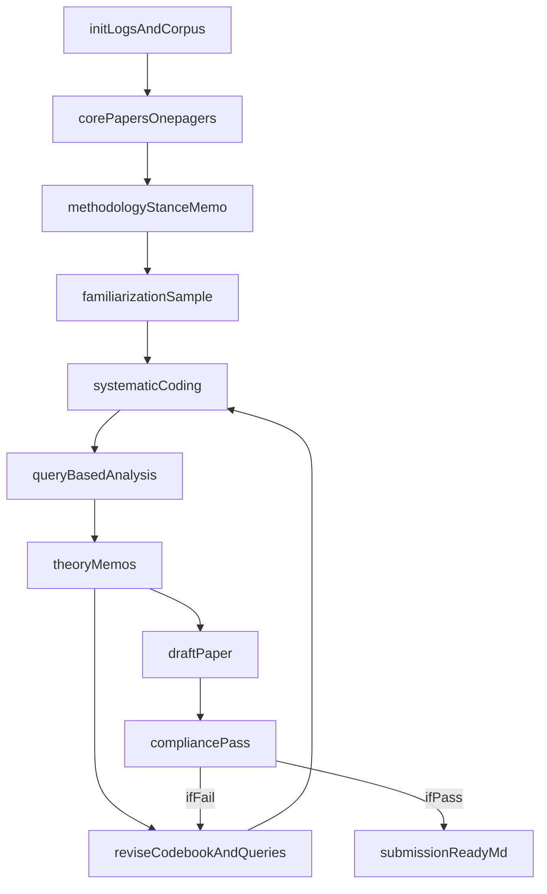

# Agents4Qual 2026: AI-led qualitative analysis workflow (repo-native)

## Non-negotiable constraints (from README + CFP)

- **AI-led**: the agent must conduct most of the research process and nearly all writing (not “AI as helper”).
- **Append-only audit trail**: all process notes/decisions/hypotheses must be kept as historical logs (append with timestamps; never overwrite past entries).
- **Data handling**: each interview is an **independent source** (not one big concatenated text).
- **Submission constraints** (from `/call/Call for Papers - AI Agents4Qual 2026.html`): **~3,500 words max** (excluding references + author reflection), **anonymous main text**, **role disclosure**, **autoethnographic reflection**, **template required**.
- **No substantive web search**: not needed because the CFP/announcement are already in [`call/`](call/), and qualitative substance comes from the interview texts + core papers.

## Repo artifacts we will create (minimal but sufficient)

### 1) Converted interview corpus

- **New folder**: [`sources_md/`](sources_md/) (keeps derived text separate from original DOCX).
- **One file per interview**: normalized naming like `Interview_01.md`, `Interview_02.md`, … with a short metadata header (participant, borough, parts) plus the transcript text.

### 2) Append-only research logs (few files, but cover everything)

- **New folder**: [`analysis/`](analysis/)
- **Append-only files (timestamped sections)**:
  - [`analysis/journal.md`](analysis/journal.md): running process log (what I did/decided/why).
  - [`analysis/core_papers_onepagers.md`](analysis/core_papers_onepagers.md): one-page summaries of each PDF in [`core_papers/`](core_papers/).
  - [`analysis/methodology_stance.md`](analysis/methodology_stance.md): contentious methodological issues + my evolving stance (explicitly linked to the core papers).
  - [`analysis/codebook.md`](analysis/codebook.md): current codes (definitions, inclusion/exclusion, examples, change log).
  - [`analysis/theory_memos.md`](analysis/theory_memos.md): hypotheses/theory building memos + how they changed.
  - [`analysis/queries_and_outputs.md`](analysis/queries_and_outputs.md): query-based analysis prompts/questions asked of the corpus + summarized answers + which sources supported them.

### 3) Final submission

- **Target**: one Markdown file, e.g. [`paper_submission.md`](paper_submission.md), structured to mirror the Word template in [`call/Template_Paper Submission_AI Agents4QualResearch_2025.docx`](call/Template_Paper%20Submission_AI%20Agents4QualResearch_2025.docx) and to satisfy CFP requirements.

## Tooling approach (kept simple)

- **DOCX → Markdown conversion**: one small Python script (or a single notebook/script) that:
  - enumerates [`sources/`](sources/) `.docx` files,
  - extracts text and writes `sources_md/*.md`,
  - writes/updates an index table in `analysis/journal.md` (append-only) noting source filename → derived md filename.
- **Core paper handling**: lightweight PDF text extraction to support one-page summaries (don’t try to “read” 10k-line PDF dumps; extract text and summarize).
- **No database**; no migrations.

## End-to-end workflow (iterative)

### Phase A — Initialize the audit trail (day 0)

- Create `analysis/` and the append-only files listed above.
- In `analysis/journal.md`, add an initial entry with:
  - date/time,
  - explicit statement that **Cursor/Agent + model** is the sole LLM,
  - the strict constraint: “append-only logs; no silent rewrites.”

### Phase B — Convert and inventory the corpus (day 0)

- Convert all `.docx` in [`sources/`](sources/) to individual `.md` in `sources_md/`.
- Create/append a corpus inventory section:
  - counts, borough distribution (from filenames where available), any encoding issues (some filenames contain mojibake like `ÔÇô`).
- Spot-check: ensure each derived `.md` corresponds to one interview file and is readable.

### Phase C — Summarize core papers (day 0–1)

- For each PDF in [`core_papers/`](core_papers/): produce **one-page** summary appended into `analysis/core_papers_onepagers.md`.
- Each one-pager includes:
  - the paper’s stance on AI + qualitative analysis,
  - implications for method choices (coding, queries, reflexivity, validity),
  - 2–4 “methodological rules” we will adopt or reject.

### Phase D — Extract the conference logic (day 0–1)

- From the CFP HTML in [`call/`](call/): write a short “submission constraints” memo in `analysis/journal.md`:
  - anonymity
  - word count accounting
  - required sections: disclosure + reflection
  - “AI-led research only” interpretation for this project.

### Phase E — Methodological stance memo (before deep coding)

- Write/append `analysis/methodology_stance.md`:
  - identify contentious issues across the core papers (e.g., what counts as “coding”, what validity looks like with AI, how to avoid shallow theme lists),
  - choose a coherent stance for this submission,
  - define what “theory” will mean here (e.g., mid-range explanatory model about loneliness experience in deprived borough contexts; mechanism-focused rather than mere topic clustering).

### Phase F — First analytic cycle (broad familiarization)

- Read a purposeful subset of interviews across boroughs and genders/ages (as available in filenames) to build sensitivity.
- Begin **initial codes** in `analysis/codebook.md` with:
  - clear definitions
  - inclusion/exclusion
  - 1–3 short evidence excerpts (with source filename references)
- Log in `analysis/journal.md` what I sampled and why.

### Phase G — Second analytic cycle (systematic coding per source)

- Iterate through **all** `sources_md/*.md`:
  - apply/update codebook
  - append key coded excerpts (lightweight) and note source coverage
- Maintain a “code drift” log: when a code changes definition, record the change and rationale.

### Phase H — Query-based iteration (Morgan-style) over the coded corpus

- Use structured queries that actively test and refine hypotheses (examples):
  - “What are recurring causal stories participants give for loneliness?”
  - “How do ‘connected places’ differ from ‘lonely places’ in terms of control, surveillance, cost, familiarity?”
  - “Where do borough differences show up (if at all)?”
  - “What contradictions appear within the same participant between part 1 vs part 2?”
- Each query and its answer is appended to `analysis/queries_and_outputs.md` with:
  - query text
  - list of supporting sources
  - tensions/negative cases
  - what changed in the codebook/theory memo as a result.

### Phase I — Theory building and memoing

- Convert themes → **claims** → **mechanisms** → **scope conditions** (what contexts it applies to).
- Keep `analysis/theory_memos.md` as the single place where the explanatory model is developed and revised.
- Actively pursue negative cases and refine the model (explicitly logged).

### Phase J — Draft the paper in template form

- Extract headings/required blocks from the Word template in [`call/Template_Paper Submission_AI Agents4QualResearch_2025.docx`](call/Template_Paper%20Submission_AI%20Agents4QualResearch_2025.docx).
- Create `paper_submission.md` with:
  - anonymized main text
  - explicit methods describing the AI-led workflow + audit trail
  - results framed as theory/insights, not just theme list
  - discussion tied back to core papers + what this implies for AI-led qualitative work
  - references
  - **mandatory disclosure checklist content** (ported from the template)
  - **autoethnographic reflection** drafted from the interaction/audit logs (default voice: first-person human investigator, with explicit disclosure that it was AI-drafted from logged interaction).

### Phase K — Compliance pass (hard requirements)

- Verify:
  - word count of main paper ≤ 3,500 (excluding references + reflection)
  - anonymity: no names/identifiers
  - every tool/model named (Cursor + the model)
  - reflection + disclosure present
  - “AI-led” is credibly evidenced by the logged workflow.

## Iteration loop (what “iterate” concretely means here)

## Key files we will leverage

- [`README.md`](README.md) for the overall workflow constraints.
- [`sources/sources_README.md`](sources/sources_README.md) for dataset context (loneliness, boroughs, two-part interview structure).
- [`call/Call for Papers - AI Agents4Qual 2026.html`](call/Call%20for%20Papers%20-%20AI%20Agents4Qual%202026.html) for submission requirements.
- [`call/Template_Paper Submission_AI Agents4QualResearch_2025.docx`](call/Template_Paper%20Submission_AI%20Agents4QualResearch_2025.docx) for final structure + disclosure checklist.

## Implementation todos

- **init-artifacts**: Create `analysis/` + append-only log files; write initial journal entry.
- **convert-docx**: Convert all interview `.docx` in [`sources/`](sources/) into one `.md` per source in `sources_md/`, and inventory them.
- **summarize-core**: Produce one-page summaries for each PDF in [`core_papers/`](core_papers/) into `analysis/core_papers_onepagers.md`.
- **method-stance**: Write contentious-methodology memo + adopted stance in `analysis/methodology_stance.md`.
- **code-and-iterate**: Build codebook, run query-based iterations, maintain theory memos (all append-only).
- **draft-submission**: Build `paper_submission.md` matching the template, with disclosure + reflection.
- **compliance**: Enforce anonymity + word count + required sections.
