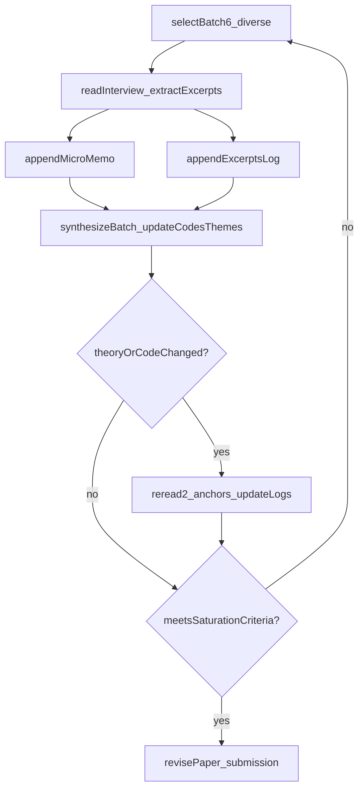

# Phase 2: Iterative reflexive thematic analysis + theory-building (building on Phase 1)

## Method choice (and why)

### Chosen TA approach: **Reflexive TA (Braun & Clarke-aligned) with dialogic/query-led analysis**

- **Why this fits the core papers**:
  - Braun & Clarke (2023) emphasize **themes as meaning-unifying interpretive stories**, reflexivity, and avoiding methodological incoherence (e.g., bolting on small-q reliability rituals). Our goal (theory-building that “goes beyond” the corpus but remains grounded) is best served by **interpretive, memo-driven work**.
  - Morgan (2025) and Friese (2025) both give AI-native procedures where analysis is **iterative questioning + evidence checking** rather than mechanical coding proxies. This supports an AI-led workflow that stays close to data.
  - This avoids the incoherence of “AI-led” + “intercoder reliability” (which would be methodologically confused in this setting).

### Chosen representation of “coding”: **Excerpt-based light coding + memoing (not full matrix coding)**

- We will **not** treat keyword scans as analysis; they will be used only for *navigation* (finding candidate segments).
- We will do **explicit excerpt tagging** for traceability:
  - For each interview we read, we will extract **3–10 short quotes** and tag them with **(a) provisional codes, (b) emerging theme claims, (c) analytic note (“why this matters”), (d) whether it supports or contradicts current theory**.
- Why this is the best fit here:
  - Keeps interpretive flexibility (reflexive TA) while forcing grounding (quotes) and enabling **disconfirmation**.
  - Avoids a heavy “coverage matrix” that can push us back toward topic/frequency logic.

## What was missing in Phase 1 (and what Phase 2 fixes)

- Phase 1 produced plausible initial claims but **did not run a disciplined iterative loop** across interviews.
- Phase 2 will implement:
  - **Sequential reading in batches**, with **explicit update points** where themes/theory are revised.
  - **Rival hypotheses + negative-case search** baked into the workflow.
  - **Re-reading** of earlier interviews whenever theory changes (documented).
  - **Stopping/saturation criteria** so we don’t pretend we must read all files if not needed.

## New/updated repo artifacts for Phase 2 (minimal additions)

- **Add**: `analysis/excerpts_log.md` (append-only)
  - One dated entry per interview read.
  - Contains 3–10 quotes + tags + support/contradiction flag.
- **Continue using** (append-only):
  - `analysis/journal.md` (process decisions + what changed + why)
  - `analysis/codebook.md` (provisional codes and change log)
  - `analysis/theory_memos.md` (theory development + negative cases)
  - `analysis/queries_and_outputs.md` (explicit analytic questions + answers + evidence pointers)

## Phase 2 workflow (iterative, with explicit decision points)

### Step A — Define “current claims to test” (start state)

- Snapshot the Phase 1 theory into a “Claim Set v1” section in `analysis/theory_memos.md`:
  - Claim 1: threat appraisal → withdrawal → reduced access → persistence.
  - Claim 2: place-based routines act as “cycle breaks.”
  - Claim 3: outsiderhood can be non-distressed (negative case).
- For each claim, define:
  - **What evidence would weaken/contradict it** (rival mechanisms).
  - **What we expect to see if it holds**.

### Step B — Sampling strategy for iterative reading (anti-confirmation)

We will proceed in **batches of 6 interviews** (not chosen by keyword hits), ensuring diversity:

- **Batch composition rule** (per batch):
  - 1–2 per borough (as available)
  - at least 2 genders (as available)
  - include at least 2 “part 2” rich interviews (places) over the batch
  - include at least 1 file previously *not* aligned with our initial model (chosen by scanning for different framings: religion/faith, work/time scarcity, grief/loss, structural constraint, chosen solitude).

### Step C — Per-interview analytic protocol (what we do for each file)

For each selected `sources_md/*.md` interview:

- **Read the transcript** (not just search) with these aims:
  - Identify segments that **fit existing codes**.
  - Identify segments that **force new codes**.
  - Identify segments that **contradict** the current theory.
  - Identify segments that **redefine the meaning** of an existing code.
- Append an entry to `analysis/excerpts_log.md`:
  - metadata: filename, borough, age, gender
  - 3–10 short quotes (verbatim)
  - tags: `[code:...] [theme:...] [supports|contradicts] [note:...]`
- Append a short “micro-memo” to `analysis/theory_memos.md`:
  - What did this interview add/change?
  - What did it challenge?

### Step D — Batch-level synthesis (after each batch of 6)

After each batch:

- Update `analysis/codebook.md`:
  - Add/merge/split codes; log changes with timestamps.
  - Explicitly note **what code was dropped** (if any) and why.
- Update `analysis/queries_and_outputs.md`:
  - Add 2–4 new analytic questions that arise from contradictions.
- Update `analysis/theory_memos.md`:
  - Revise the theory (v2, v3, …) with:
    - mechanisms
    - scope conditions
    - negative cases
    - competing explanations not yet resolved
- Update `analysis/journal.md`:
  - what changed + why
  - what we will read next + why

### Step E — Re-reading rule (to avoid drift and cherry-picking)

Whenever we:

- split a theme,
- substantially redefine a central code,
- or introduce a new scope condition,

we must **re-read**:

- at least 2 earlier “anchor” interviews (one that supports the old version and one negative case) and append a short re-read note in `analysis/journal.md` + any new excerpts in `analysis/excerpts_log.md`.

## Saturation / stopping criteria (explicit)

We stop reading new interviews when **all** are true:

- **Code stability**: in the last 2 batches (12 interviews), no new codes are created and no core code changes definition.
- **Theme stability**: themes stop splitting/merging across the last 2 batches.
- **Negative-case stability**: we can name at least 3 negative case patterns and explain whether they are:
  - boundary cases (scope limits),
  - rival mechanisms, or
  - evidence that falsifies a claim.
- **Evidence sufficiency**: each final theme has:
  - ≥ 6 interviews contributing supporting excerpts,
  - ≥ 2 interviews contributing tension/complication excerpts,
  - and ≥ 1 explicit negative case.

If any criterion fails, read another batch.

## Deliverable updates (paper)

### Paper revisions required

- **Remove** the entire `## Author reflection` section from `paper_submission.md` (per your instruction) and ensure the paper remains coherent without it.
- Strengthen Findings/Discussion with:
  - clear theme definitions (interpretive stories)
  - explicit scope conditions
  - explicit negative cases and how they modify the theory
  - more direct quotes (short) with filename pointers
- Keep the **AI involvement checklist** section (template requirement).

### Word-count discipline

- Maintain main text ≤ 3500 words (excluding references and any required non-counted sections).

## Mermaid: Phase 2 iteration loop

## Implementation todos (Phase 2 continuation)

- **phase2-artifacts**: Add `analysis/excerpts_log.md` (append-only) and seed with a header describing tagging conventions.
- **phase2-batch1**: Read first batch of 6 interviews (diverse), log excerpts + micro-memos.
- **phase2-synthesis1**: Update codebook/themes/theory; document changes; define new queries.
- **phase2-batchN**: Repeat until saturation criteria met.
- **paper-rewrite**: Revise `paper_submission.md` findings/discussion with matured themes + quotes; remove author reflection.
- **final-compliance**: Re-check anonymity + word limits + checklist presence.
